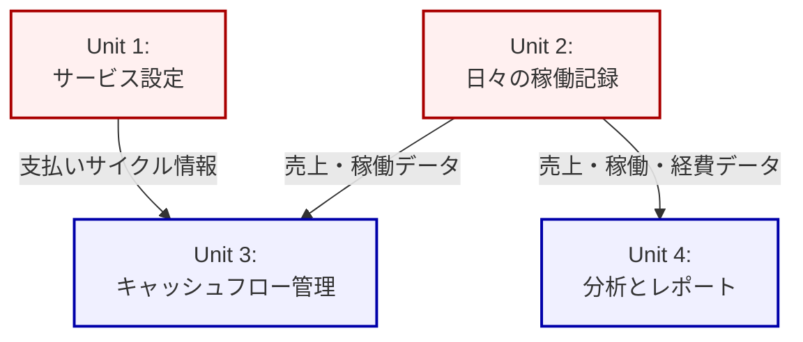

# コンテキストマップ

このドキュメントは、定義された作業ユニット間の関係性を視覚的に表現するコンテキストマップです。

## 関係性の説明

-   **Unit 1 (サービス設定) & Unit 3 (キャッシュフロー管理)**
    -   Unit 1は支払いサイクルの設定情報（締め日、支払日など）を保持します。
    -   Unit 3はこの情報を利用して、正確な入金予定日を計算します。
    -   関係: Unit 1 (Upstream) -> Unit 3 (Downstream)

-   **Unit 2 (日々の稼働記録) & Unit 3 (キャッシュフロー管理)**
    -   Unit 2は日々の売上データを記録します。
    -   Unit 3はこの売上データを基に、各支払いサイクルで支払われる金額を算出します。
    -   関係: Unit 2 (Upstream) -> Unit 3 (Downstream)

-   **Unit 2 (日々の稼働記録) & Unit 4 (分析とレポート)**
    -   Unit 2は売上、経費、稼働時間など、分析の元となる全ての基礎データを記録します。
    -   Unit 4はこのデータを多角的に分析し、グラフや時給などのレポートを生成します。
    -   関係: Unit 2 (Upstream) -> Unit 4 (Downstream)
